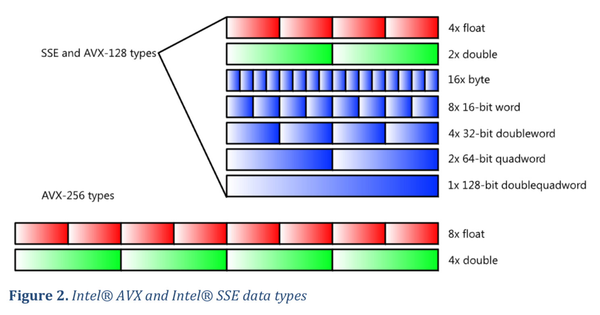

## Introduction to SIMD

### What is SIMD?
SIMD (Same Instruction Multiple Data) is technique where a CPU performs an operation on multiple operands concurrently. SIMD can reduce the number of instructions needed to perform a certain task and make algorithms faster. SIMD is widely used in many programming domains such as graphics programming and image processing. 

### SIMD extensions for the x86 Processors
The x86 processor architecture has various SIMD extensions. I will only focus on the AVX extensions, AVX2, and FMA extensions in this blog post series. AVX instruction can operate on 256-bit wide registers, these are named `ymm0`-`ymm15`. The lower 128 bits of these registers are aliased to `xmm0`-`xmm1`. One of these registers can hold multiple values of a given types as shown in the image below. This is called packed data.



### Scalar Data
Most AVX instructions operate on scalar or packed data. A single-precision floating point number can be moved using the `vmovss` instruction and `vmovsd` can be used for moving double-precision floating point data. The following program swaps the contents at the `a` and `b` labels using four `vmovsd` instruction.
```asm
.data
a: .double 320.0
b: .double 200.0
.text
swap:
    vmovsd  a(%rip), %xmm0
    vmovsd  b(%rip), %xmm1
    vmovsd  %xmm1, a(%rip)
    vmovsd  %xmm0, b(%rip)
```
The AVX instruction set provides several instruction for performing arithmetic operations on scalar data. The `vaddss` instruction adds two single-precision floating point values together. It requires three operands, two source operands and one destination operand. Just like `vmovss` by swapping the last letter of the mnemonic to a `d` we get the double-precision equivalent of this instruction. A lot more arithmetic instruction are available for scalar data, here are some of them.

| mnemonic | description                                             |
|----------|---------------------------------------------------------|
| `vaddss` | Add scalar single-precision floating-point values.      |
| `vaddsd` | Add scalar double-precision floating-point values.      |
| `vsubss` | Subtract scalar single-precision floating-point values. |
| `vsubsd` | Subtract scalar double-precision floating-point values. |
| `vmulss` | Multiply scalar single-precision floating-point values. |
| `vmulsd` | Multiply scalar double-precision floating-point values. |
| `vdivss` | Divide scalar single-precision floating-point values.   |
| `vdivss` | Divide scalar double-precision floating-point values.   |

The following program calculates the area of a circle using AVX instructions. Notice that RIP-relative addressing was used where memory operands are accessed using the `label(%rip)` syntax.
```asm
.data
pi: .float 3.14
radius: .float 5.2
area: .float ?
.text
    vmovss  radius(%rip), %xmm0     # load the radius
    vmulss  %xmm0, %xmm0, %xmm0     # square the radius
    vmulss  pi(%rip), %xmm0, %xmm0  # multiply by pi
    vmovss  %xmm0, area(%rip)       # write the result to memory
```
### Packed Data
The `vmovaps` and `vmovapd` instructions can be used to move aligned packed floating-point data. Data is aligned when it starts at an address that is divisible by a given number. When moving packed data from or to a 128-bit register the address of the source operand needs to be a 16-byte aligned address. When moving packed data from or to a 256-bit register the address of the memory operand needs to be a 32-byte aligned address. When its uncertain whether data is aligned, `vmovups` and `vmovupd` should be used for moving unaligned packed floating-point values. When possible always align data to its correct boundary since accessing unaligned data may result in performance penalties. Just like with scalar data, the AVX instruction set allows us to perform operations on packed data. Many of the instructions that operate on packed data have a similar mnemonic as their scalar counterpart but have the suffix `ps` or `pd` instead of `ss` or `sd`. The table below lists some of them.

| mnemonic | description                                             |
|----------|---------------------------------------------------------|
| `vaddps` | Add packed single-precision floating-point values.      |
| `vaddpd` | Add packed double-precision floating-point values.      |
| `vsubps` | Subtract packed single-precision floating-point values. |
| `vsubpd` | Subtract packed double-precision floating-point values. |
| `vmulps` | Multiply packed single-precision floating-point values. |
| `vmulpd` | Multiply packed double-precision floating-point values. |
| `vdivps` | Divide packed single-precision floating-point values.   |
| `vdivps` | Divide packed double-precision floating-point values.   |

The following code demonstrates how a four component vector can be multiplied by a scalar. The `vbroadcastss` instruction is used to fill 128-bit or 256-bit registers with a single-precision floating-point value. The `.align` directive was used to align `vector` on a 16 byte boundary. 
```asm
.data
.align 16
vector: .float 1.0, 2.0, 3.0, 4.0
scalar: .float 0.5
result: .fill 4, 4, ?
.text
scalef32:
    vmovaps vector(%rip), %xmm0
    vbroadcastss scalar(%rip), %xmm1
    vmulps  %xmm1, %xmm0, %xmm0
    vmovups %xmm0, result(%rip)
```