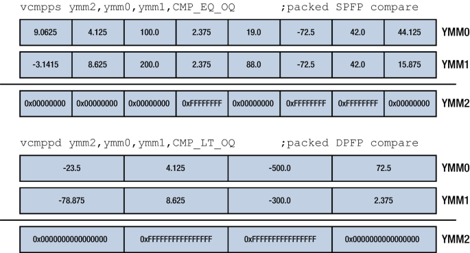

* Masking
* Comparing
* Blending

### Conditional Loading

### Masking
Packed floating point data can conditionally be moved around using the `vmaskmovps` and `vmaskmovpd` instructions. They require two source and one destination operand. The instructions copy the data from the second operand to the third operand only if on a mask which is the second operand.

### Comparing
Packed floating point data can be compared using the `vcmpps` and `vcmppd` instructions for single and double-precision data respectively. These instructions require four operands. The first operand is an immediate value that indicates the type of comparison which gets performed. The second and third operands get compared against each other and the last operand is where the result gets stored in. When the comparison matches for an element the bits for that element in the destination operand gets set to all ones. If the comparison fails all the bits of that element get set to zero.



| mnemonic | 1st operand | description                                           |
|----------|-------------|-------------------------------------------------------|
| vcmpps   | ymm1        | compare packed single-precision floating point values |
| vcmppd   |             | compare packed double-precision floating point values |


```asm
.text
.byte
to_upper:
    vcmpps  %
```

### Blending


Suppose we want to perform addition between two arrays of single-precision floating point numbers. We can write a function that makes use of SIMD instruction in order to speed up this operation.
```cpp
extern "C" void addf32(const f32* vec1, const f32* vec2, u64 len; f32* res);
```
The parameters `vec1`, `vec2`, `len`, and `res` are passed through the registers`rdi`, `rsi`, `rdx`, and `rcx` respectively.
```asm
.globl addf32
addf32:
    xorq    %rax, %rax
    jmp     packed_test
packed_loop:
    vmovups (%rdi, %rax, 4), %ymm0
    vaddps  (%rsi, %rax, 4), %ymm0, %ymm0
    vmovups %ymm0, (%rcx, %rax, 4)
    addq    $8, %rax
    subq    $8, %rdx
packed_test:
    cmpq    $8, %rdx
    jae     packed_loop
    jmp     scalar_test
scalar_loop:
    vmovuss (%rdi, %rax, 4), %xmm0
    vaddss  (%rsi, %rax, 4), %xmm0, %xmm0
    vmovuss %xmm0, (%rcx, %rax, 4)
    addq    $1, %rax
    subq    $1, %rdx
scalar_test:
    orq     %rdx, %rdx
    jnz     scalar_loop
    ret
```
The first instruction of this procedure makes sure that the contents of the `rax` register is zero. This is because `rax` will be used for indexing. After that the program will jump to the `packed_test` label where will be checked whether the source operands contain eight more elements. If this is the case, a packed addition will be performed. Else, the scalar.

