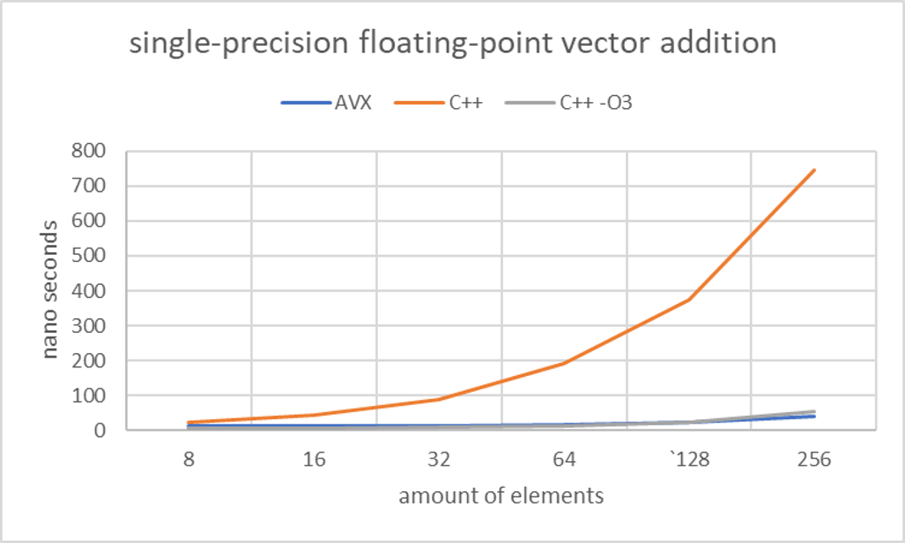

// TODO: Find a highlighter that properly supports the AT&T syntax for x86 assembly.

:source-highlighter: pygments
:pygments-style: default
:stem:
:nofooter:

= An Introduction to SIMD
Jochem Arends

IMPORTANT: This is not an introduction to x86_64 assembly language and I do assume that the reader has a basic understanding of x86_64 assembly and is familiar with concepts such as calling conventions, memory alignment, and RIP-based addressing.

== Part 1

=== Introduction
SIMD (Same Instruction Multiple Data) is a parallel processing technique implemented by many CPUs to perform a single operation on multiple operands simultaneously. SIMD reduces the number of instructions needed to perform a certain task and can increase the speed of a program. SIMD is widely used in domains such as image processing, digital signal processing, and 3D graphics.

=== SIMD Extensions for the x86 Architecture
x86 processors can implement various SIMD extensions such as MMX, SSE, AVX, and FMA. In this document I will give a quick introduction to AVX (Adcvanced Vector Extensions). AVX includes the AVX, AVX2, and AVX-512 extensions. This document won't cover the AVX-512 extension since my CPU did not support that one. When following along with this tutorial, make sure that your CPU supports the AVX and AVX2 extensions or use a virtual machine that supports these.

=== AVX Registers
In addition to the regular registers available on x86_64, AVX introduces 16 new 256-bit registers named `ymm0`-`ymm15`. The lower 128 bits of these registers can be accessed independently and are aliased to `xmm0`-`xmm15`. A 256-bit register can hold up to eight single-precision or up to four double-precision floating-point values. The image below visualizes how multiple data values can be packed into a single register.

.AVX Registers
image::./images/registers.png[AVX Registers, width=50%, align="center"]

=== Scalar Data
The AVX instruction set provides several instruction for working with scalar data. A single-precision or double-precision floating-point value can be moved using the `vmovss` or `vmovsd` instructions respectively. Most AVX instruction that operate on single-precision floating-point data have a double-precision counterpart. The double-precision equilevant of such instructions can most time be obtained by swapping the last 's' of the mnemonic with a 'd'. Arithmetics also can be done using the AVX instruction set. Many AVX instructions use non-destructive source operands. Instead of storing the result in one of the source operands, an additional operand is required that will hold the result of the operation. In order to add two scalar floating-point values, the `vaddss` or `vaddsd` instructions can be used. A lot more arithmetic instruction are available such as `vsubs[s|d]` for subtraction, `vmuls[s|d]` for multiplication, and `vdivs[s|d]` for division. The code snippet below demonstrates how the area of a circle can be calculated using AVX instructions.

[source, nasm]
----
.data
pi: .float 3.14
radius: .float 5.2
area: .float 0.0
.text
scalar_example:
    vmovss  radius(%rip) %xmm0      # load the radius from memory
    vmulss  %xmm0, %xmm0, %xmm0     # square the radius
    vmulss  pi(%rip), %xmm0, %xmm0) # multiply by pi
    vmovss  %xmm0, area(%rip)       # store result in memory
    ret
----

=== Packed Data
In order to move packed single-precision floating-point data, the `vmovaps` or `vmovups` instructions can be used. The `vmovaps` instruction requires memory operands to be aligned on a 16-byte boundary for 256-bit wide operands or a 32-byte boundary for 256-bit wide operands. When not sure whether data is properly aligned, always use the `vmovups` instruction. Just like with scalar data, the AVX instruction set also allows us to perform arithmetic operations on packed data. These instructions have a similar mnemonic as their scalar counterpart but have the suffix `ps` or `pd` instead of `ss` or `sd`. For example, `vaddps` or `vaddpd` can be used to add two packed floating-point values, `vsubp[s|d]` for subtraction, `vmulp[s|d]` for multiplication, and `vdivp[s|d]` for division. The image below below displays how when performing an operation on packed data the result will also be stored in the packed format.

.SIMD vs Scalar
image::./images/simd_vs_scalar.png[SIMD vs Scalar, width=50%, align="center"]

=== Scalar to Packed
Sometimes it can be useful to convert a scalar value to packed. The `vbroadcasts[s|d]` instructions copy a scalar value to each element of packed data. When broadcasting a single-precision floating-point value to a 256-bit wide operand, it gets copied eight times since stem:[256 / 32 = 8]. The code snippet below demonstrates how a four component vector can be multiplied by a scalar using AVX instructions.

[source, nasm]
----
.data
.align 32
vec: .double 1.0, 2.0, 3.0, 4.0
res: .double 0.0, 0.0, 0.0, 0.0
num: .double 3.0
.text
packed_example:
    vbroadcastsd num(%rip), %ymm0
    vmulpd vec(%rip), %ymm0, %ymm0
    vmovapd %ymm0, res(%rip)
    ret
----

=== Masking
Packed data can conditionally be moved around with something called a mask. A mask is a packed data operand where for each element the most significant bit determines whether that element gets moved. The `vmaskmovp[s|d]` instructions conditionally load and store packed floating-point data. The first operand contains the source data, the second operand contains the mask data, and the last operand is where result gets stored. When the mask bit is set, its corresponding element in the source operand gets copied into the same element of the destination operand. When the mask bit is cleared a `0` will be written to that element of the destination operand.

== Part 2
=== Project Setup
Now we have covered some AVX instructions, we're ready to write a small program that uses these. For this project, I've used CMake and the GCC compiler. The file structure of the project is quite simple and only contains a `CMakeLists.txt`, `main.cpp`, and `avx.S` file. The code block below displays the contents of the `CMakeLists.txt`.

.CMakeLists.txt
[source, cmake]
----
cmake_minimum_required(VERSION 3.20)

project(simd CXX ASM) 

add_executable(simd main.cpp avx.S)
----

=== Vector Addition
A operation I decided to implement is vector addition because such a function is easy to modify to perform any other arithmetic operation. The C++ declaration for this funciton is.

[source, cpp]
----
extern "C" void addf32(const float* vec1, const float* vec2, std::uint64_t len, float* res);
----

The x86_64 code is shown below. Variable number of elements. For the following function, the parameters `vec1`, `vec2`, `len`, and `res` are passed through the registers `rdi`, `rsi`, `rdx`, and `rcx` respectively.

.avx.S
[source, nasm]
----
.globl addf32
.text
addf32:
    jmp     scalar_test
scalar_loop: <1>
    vmovss  -4(%rdi, %rdx, 4), %xmm0
    vaddss  -4(%rsi, %rdx, 4), %xmm0, %xmm1
    vmovss  %xmm1, -4(%rcx, %rdx, 4)
    subq    $1, %rdx
scalar_test: <2>
    testq   $7, %rdx
    jnz     scalar_loop
    testq   %rdx, %rdx
    jz      done
float8_loop: <3>
    vmovups -32(%rdi, %rdx, 4), %ymm0
    vaddps  -32(%rsi, %rdx, 4), %ymm0, %ymm1
    vmovups %ymm1, -32(%rcx, %rdx, 4)
    subq    $8, %rdx
    jnz     float8_loop
done:
    vzeroupper <4>
    ret
----
<1> Performs addition one element at a time.
<2> Checks if remainder is less than eight.
<3> Performs addition eight elements at a time.
<4> Prevents performance penalties.

At the start of the funcion we first need to check whether the length of the vector is a multiple of eight. If this is not the case, we first want to perform the operation on the last `len % 8` elements (calculated using `len | 8`). The length parameter which is stored in `rdx` is used for indexing, that's why the offsets `-4` and `-32` are used to get the index of the last element and last eight elements. The `vzeroupper` instruction at the end of this function, clears the upper 128 bits of the registers `ymm0`-`ymm15`. When this instruction is omitted, performance penalties may occur if the SSE instruction set gets used later in the program. The C++ program below calls our function and is can be used to roughly check whether it's working.

.main.cpp
[source, cpp]
----
#include <iostream>
#include <cstdint>

extern "C" void addf32(const float* vec1, const float* vec2, std::uint64_t len, const float* res);

// for printing an array of floats
template<std::uint64_t N>
std::ostream& operator<<(std::ostream& os, const float (&vec)[N]) {
    os << '(';

    for (std::uint64_t idx{}; idx < (N - 1); ++idx) {
        os << vec[idx] << ',';
    }

    return os << vec[N - 1] << ')';
}

int main() {
    constexpr std::uint64_t len{3};
    float vec1[len]{1.0f, 2.0f, 3.0f};
    float vec2[len]{4.0f, 5.0f, 6.0f};
    float vec3[len];
    
    addf32(vec1, vec2, len, vec3);

    std::cout << vec1 << " + " << vec2 << " = " << vec3 << '\n';
}
----

.output
[source, txt]
----
(1,2,3) + (4,5,6) = (5,7,9)
----

== Part 3
=== Google Benchmark
The main reason for us to utilize SIMD is to speed up certain operations. We need to benchmark our function to be certain the SIMD version executes faster. For this, I've decided to use the Google Benchmark library. To use benchmarking in our program we create a `benchmarks.cpp` file and modify the `CMakeLists.txt` to add the following lines if you already have Google Benchmark installed.

[source, cmake]
----
add_executable(benchmarks benchmarks.cpp avx.S)

find_package(benchmark REQUIRED)

target_link_libraries(benchmarks PRIVATE benchmark::benchmark)
----

If this is not the case you can add the following lines instead.

[source, cmake]
----
enable_testing()

include(FetchContent)

FetchContent_Declare(
        googletest
        GIT_REPOSITORY https://github.com/google/googletest.git
        GIT_TAG v1.14.0
)

FetchContent_Declare(
        googlebenchmark
        GIT_REPOSITORY https://github.com/google/benchmark.git
        GIT_TAG main
)

FetchContent_MakeAvailable(googletest googlebenchmark)

add_executalble(benchmarks benchmarks.cpp avx.S)

target_link_libraries(benchmarks PRIVATE benchmark::benchmark)
----

The program below benchmarks the `addf32` function and its C++ equilevant.

.benchmarks.cpp
[source, cpp]
----
#include <benchmark/benchmark.h>
#include <cstdint>
#include <random>
#include <algorithm>

#define SYSV __attribute__((sysv_abi)) // make sure correct calling convention is used

namespace avx {
    extern "C" SYSV void addf32(const float* vec1, const float* vec2, std::uint64_t len, float* res);
}

namespace cpp {
    void addf32(const float* vec1, const float* vec2, std::uint64_t len, float* res) {
        for (std::uint64_t idx{}; idx < len; ++idx) {
            res[idx] = vec1[idx] + vec2[idx];
        }
    }
}

struct fixture : benchmark::Fixture {
    void SetUp(const ::benchmark::State& state) override {
        std::random_device device{};
        std::mt19937 engine{device()};
        std::uniform_real_distribution<float> distribution(0.0f, 100.0f);

        auto random = [&]() {
            return distribution(engine);
        };

        std::generate_n(vec1, len, random);
        std::generate_n(vec2, len, random);
        std::generate_n(vec3, len, random);
    }

    static constexpr std::uint64_t len{256};
    float vec1[len];
    float vec2[len];
    float vec3[len];
};

BENCHMARK_F(fixture, avx_addf32)(benchmark::State& state) {
    for (auto _ : state) {
        avx::addf32(vec1, vec2, len, vec3);
    }
}

BENCHMARK_F(fixture, cpp_addf32)(benchmark::State& state) {
    for (auto _ : state) {
        cpp::addf32(vec1, vec2, len, vec3);
        benchmark::ClobberMemory(); // prevents optimizations
    }
}

BENCHMARK_MAIN();
----

=== Results
I've run the benchmarks multiple times where `fixture::len` equals 8, 16, 32, 64, 128, and 256. I've also benchmarked the C++ function with the `-O3` flag enabled. In the figure below the results are plotted. As you can see, on my machine, the optimized version is slightly faster when operating on smaller vectors but when increasing the vector length, the AVX version does outperform the optimized C++ version just by a bit.

== Resources Used
For this topic I've used a book called "Modern X86 Assembly Language Programming" by Daniel Kusswurm. I've also used https://www.felixcloutier.com/x86/[felixcloutier.com/x86/] as a reference for the x86 instruction set.
